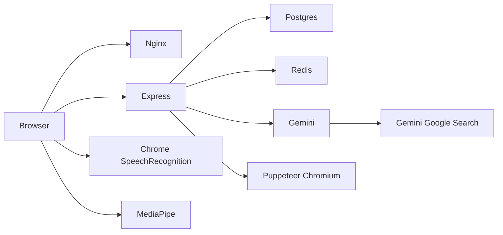

# System audit — Hirevia

**Date:** 27 September 2026  
**Scope:** End-to-end product flow, reliability, Gemini credit burn, latency, and the 1 vCPU / 4 GB deployment shape.  
**Method:** Code-path review of routes, controllers, `ai.service.js`, quota, Redis cache, and frontend hooks. No live APM or production traces were available; times below are inferred from call shape and existing UI copy (“Usually takes 40 to 80 seconds”).

---

## Executive summary

The product is a **synchronous Gemini pipeline** wrapped in Express. Almost every expensive user action holds an HTTP request open until Google returns. That is the main reliability, cost, and latency story.

The three highest-severity issues:

1. **Follow-up questions burn Gemini on every mock answer** and are **not** counted against the 3-mock monthly quota. One mock can cost more tokens than a full prep plan.
2. **Deleting a plan or mock refunds quota**, because usage is `COUNT(*)` of remaining rows. A user can generate 5, delete 5, generate 5 again.
3. **Plan generation and resume PDFs are unbounded wall-clock jobs** on one CPU. Nginx has no raised `proxy_read_timeout`, so Docker deploys can 504 around 60s while Gemini is still working. Puppeteer can OOM the 4 GB box.

Quotas (5 plans / 3 mocks) cap *starts*, not *token volume*. Resume PDFs are unlimited except 12/hour. Admins have no Gemini cap at all.

---

## System map

| Screen | Route | Primary APIs | Heavy work |
| --- | --- | --- | --- |
| Landing | `/` | `GET /api/auth/get-me` | None |
| Login / register | `/login`, `/register` | auth POST | bcrypt |
| Dashboard | `/app` | `GET /api/interview/` | Slim list from Postgres |
| New plan | `/app/new` | `POST /api/interview/` | Search + huge JSON Gemini |
| Plan | `/interview/:id` | `GET /api/interview/report/:id` | Full JSONB blob |
| Resume download | same page | `POST /api/interview/resume/pdf/:id` | Gemini HTML + Chromium |
| Start mock | `/interview/:id/mock` | `POST .../mock` | Fresh 9-question Gemini |
| Live mock | `/mock/:mockId` | `POST .../answer` each Next | Follow-up Gemini |
| Score mock | `/report` | `POST .../mock/:mockId` | Evaluation Gemini |
| Admin | `/admin` | `GET /api/admin/users` | Per-user correlated counts |

Auth is cookie JWT. All mutating interview calls need header `X-Requested-With: hirevia`.

---

## End-to-end flows (how work actually moves)

### 1. Create a prep plan — the fat pipe

**Analogy:** Two trucks must unload at the same dock, in order, before the customer can leave. The dock is your one Node process. Google is the warehouse. The customer waits in the driveway the whole time.

1. Browser sends multipart (JD, company, YOE, window, optional 3 MB PDF).
2. Rate limits: 8/user/hour and 40/IP/hour (`planByUser` / `planByIp`).
3. `pdf-parse` extracts text in-process (CPU spike).
4. **Quota check** (`assertCanConsume` — count rows this UTC month). Not a lock.
5. **Gemini #1 — Search** (`gemini-2.5-flash` / `2.0-flash`, up to 4 attempts): company hiring brief.
6. **Gemini #2 — structured report** (lite → flash → 2.0-flash, up to 6 attempts): 8–14 technical Qs with model answers, 6–10 STAR behavioral, skill gaps, **exactly N roadmap days** (3–28). Prompt includes full resume + JD + research brief.
7. Server-side grounding filter + programmatic JD tech gaps + Google/YouTube URL attach.
8. Insert `interview_reports`, cache in Redis 24h.

**Typical wall time:** 40–90s happy path. **Worst case:** research retries + report retries → several minutes, or a 504.

**Quota:** 1 if the INSERT succeeds. **0 if Gemini or insert fails** (tokens already spent).

### 2. Study a plan

**Analogy:** Fetching the whole filing cabinet when the user asked for one folder.

`GET /report/:id` returns resume text, JD, all questions, all model answers, company research, and the full roadmap. Redis helps repeat views. Dashboard list is slim (title, score, gaps only) — that path is healthy.

### 3. Download resume

**Analogy:** Opening a print shop (Chromium) for every single page, then closing the shop.

1. Load stored text (no re-parse of PDF).
2. Gemini rewrites to HTML (ATS rules, 4 templates).
3. Inject missing links; strip scripts.
4. **Launch a new Chromium**, measure height, scale to one A4, PDF, close.

No monthly quota. Hourly cap 12/user. Two overlapping downloads can exhaust 4 GB RAM.

### 4. Live mock

**Analogy:** The monthly ticket is punched when you enter the theater. Every spoken line after that still pays a separate Gemini toll.

1. Quota check, then Gemini writes 5 technical + 4 behavioral (or fallback to the plan’s questions).
2. Row inserted → **mock quota consumed**.
3. Browser: camera, MediaPipe WASM/models from jsDelivr + Google Storage, Chrome speech-to-text, `speechSynthesis`.
4. Each **Next** (if not already a follow-up): **another Gemini call** to decide follow-up. Inserted questions are extra turns, each billed.
5. Last answer → `interviewComplete` → Gemini scores all transcripts. Presentation score is local math on `videoMetrics`.

Video never uploads. Speech audio may go to Google via the browser API (not your Gemini key).

### 5. Admin / quotas

Global defaults in `app_settings`. Per-user caps nullable. `quota_grants` add remaining for `YYYY-MM` only. Admins bypass `assertCanConsume`. Login with seeded `ADMIN_EMAIL` / `ADMIN_PASSWORD` lands on `/admin`.

---

## Screen audits

### Landing / login / register — `/`, `/login`, `/register`

**User flow:** A locked front door. Cheap if the lock works.

**What happens today:** `get-me` on every app load. Login/register limited to 5/IP/minute.

**Findings**

| # | Layer | Issue | Impact | Evidence |
|---|-------|-------|--------|----------|
| 1 | BE | `get-me` loads user **plus 8+ quota queries** (settings, 4 counts, 2 grant sums) | Med | `quota.service.js` `getQuotaForUser` |
| 2 | Ops | `NODE_ENV=production` + localhost `DATABASE_URL` **refuses to boot** | High locally | `validateEnv.js` |

**Resolutions**
1. **Quick win** — Cache quota on the user object for 30–60s, or skip quota on `get-me` and fetch it only on New plan / mock start.
2. **Ops** — Keep `NODE_ENV=development` on the VPS until TLS Postgres is real.

### Dashboard — `/app`

**User flow:** Like asking for a table of contents, not the books. This screen is one of the healthier ones.

**What happens today:** `GET /api/interview/` slim columns. Progress chart is client-side.

**Findings**

| # | Layer | Issue | Impact | Evidence |
|---|-------|-------|--------|----------|
| 1 | BE | No pagination | Low until a power user has dozens of plans | `findAllByUser` |
| 2 | FE | Shared `InterviewContext.loading` | Med | `startMock` / `getReports` flip the same flag |

### New plan — `/app/new`

**User flow:** Like ordering a custom suit and standing in the tailor’s shop until both fittings finish.

**What happens today:** Wizard → one POST → overlay for 40–80s+. Quota shown from last `get-me`.

**Findings**

| # | Layer | Issue | Impact | Evidence |
|---|-------|-------|--------|----------|
| 1 | BE | Two sequential Gemini calls, second output is huge (28-day plan possible) | High time + tokens | `researchCompanyHiring` then `generateInterviewReport` |
| 2 | BE | Retry matrix up to **4 Search + 6 report** calls on 429/503 | High credits | `generateContentWithRetry` |
| 3 | BE | Quota is check-then-generate, **no row lock** | Med (double spend) | `assertCanConsume` then AI then INSERT |
| 4 | Edge | Nginx default ~60s proxy timeout | High in Docker | `Frontend/nginx.conf` has no `proxy_read_timeout` |
| 5 | BE | No Gemini client timeout | High hang | `@google/genai` call has no abort |
| 6 | FE | Quota on screen can be stale until refresh | Low | `refreshUser` only after success |

**Resolutions**
1. **Structural** — Queue plan jobs; return `202` + poll. Unblocks nginx and the 1-CPU box.
2. **Credits** — Cap roadmap days for generation (e.g. 14) even if the window is a month; attach remaining days as templates server-side.
3. **Credits** — Do not fall through all three models on 429; treat 429 as “stop, user retries later.”
4. **Correctness** — Insert a `usage_events` row (or `SELECT … FOR UPDATE`) **before** Gemini, or unique monthly counter.

### Plan page — `/interview/:id`

**User flow:** Bringing the entire warehouse to the showroom so the customer can read one shelf.

**What happens today:** Full report in memory/context. Question reader is local. Resume picker hits PDF endpoint.

**Findings**

| # | Layer | Issue | Impact | Evidence |
|---|-------|-------|--------|----------|
| 1 | BE | Full JSONB over the wire (resume + model answers + 28 days) | Med TTI | `mapInterviewReport` non-slim |
| 2 | FE | Attempt mock disabled at 0 mocks — good | — | `Interview.jsx` |

### Resume PDF (from plan page)

**User flow:** Starting a printing press for one flyer.

**Findings**

| # | Layer | Issue | Impact | Evidence |
|---|-------|-------|--------|----------|
| 1 | Cost | **No monthly quota** | High credits if abused | Only `pdfByUser` 12/hour |
| 2 | RAM | New Chromium per request; `browser.close()` skipped if `setContent`/`pdf` throws | High OOM | `generatePdfFromHtml` |
| 3 | CPU | Scale-to-one-page after full layout | Med | same function |

**Resolutions**
1. **Quick win** — `try/finally { await browser.close() }`; serialize PDFs with a 1-slot mutex.
2. **Credits** — Count PDFs in monthly quota or cache HTML per `{reportId, template}` for 24h.

### Start mock — `/interview/:id/mock`

**Analogy:** Punching the meal ticket, then cooking a new meal. If the kitchen burns the food, you still lose the ticket and get yesterday’s leftovers.

**Findings**

| # | Layer | Issue | Impact | Evidence |
|---|-------|-------|--------|----------|
| 1 | BE | Gemini failure **still creates a mock** via fallback → quota consumed | High UX + quota | `createMockInterviewController` catch → `fallbackQuestionsFromReport` |
| 2 | BE | Prompt includes **all existing plan questions** to “avoid” plus resume/JD/research | Med tokens | `generateFreshMockQuestions` |
| 3 | FE | `startMock` sets global `loading` | Med | `useMockInterview.js` |

### Live mock — `/mock/:mockId`

**Analogy:** A taxi meter that starts a new fare at every traffic light, on top of the airport pickup fee you already paid.

**What happens today:** TTS, STT, MediaPipe every ~80ms. Next → save answer + follow-up Gemini.

**Findings**

| # | Layer | Issue | Impact | Evidence |
|---|-------|-------|--------|----------|
| 1 | Cost | Follow-up Gemini **per non-follow-up answer** (5+4 = 9 planned, plus extras) | **Critical credits** | `submitMockAnswerController` |
| 2 | Time | Each Next waits on Gemini (2–8s+); 429 retries stack | High perceived lag | `generateFollowUpQuestion` + retry helper |
| 3 | FE | First mock: download Face + Pose models from CDN | Med first-load | `videoAnalyzer.js` |
| 4 | Privacy | Chrome SpeechRecognition may send audio to Google | Product/legal | `useSpeechRecognition.js` |
| 5 | Rate | 80 answers/user/hour — enough to spam follow-up Gemini | High | `answerByUser` |

A **complete mock** (9 base + ~4 follow-ups + 1 score) is often **14–15 Gemini calls**. Monthly quota still says “3 mocks.”

**Resolutions**
1. **P0 credits** — Skip follow-up model if answer length/score heuristic is clearly complete; or budget “N follow-up calls per mock.”
2. **P0 credits** — Rate-limit follow-up generation separately (e.g. 15/hour).
3. **UX** — Prefetch MediaPipe on dashboard, not on first “Start answering.”

### Mock report — `/mock/:id/report`

Sends **all answers + expected answers + videoMetrics** as pretty-printed JSON into Gemini. One more large completion. Retrying a failed score **re-bills** (no idempotency key).

### Admin — `/admin`

**Analogy:** A clerk walking to the warehouse once per customer to count boxes, instead of one inventory query.

`listUsersWithQuota` runs **six correlated subqueries per user**. Fine for tens of users; painful at hundreds.

---

## AI credit map (what actually bills `GOOGLE_GENAI_API_KEY`)

| Event | Gemini calls (happy) | Worst-case calls (retries) | Counted in monthly quota? |
| --- | ---: | ---: | --- |
| Create plan | 2 (Search + report) | up to 10 | Yes (1 plan) if saved |
| Plan Gemini fails | 1–10 | same | **No** (retry is free on quota, paid on Google) |
| Resume PDF | 1 | up to 6 | **No** (hourly 12 only) |
| Start mock | 1 | up to 6 | Yes (1 mock) even on fallback |
| Each mock answer (not a follow-up) | 1 follow-up judge | up to 6 | **No** |
| Finish mock | 1 eval | up to 6 | **No** |
| Admin generates | same as user | same | **No** |

**Rough token shape (order of magnitude, not a bill):**

- Plan report output is the monster: 9+ long model answers + up to 28 days × (details + 4–8 tasks + resources). That is the single most expensive completion.
- Search grounding uses **Flash, not lite**, and billed search usage on top of tokens.
- Follow-ups are individually small but **high frequency** — they will dominate cost at even modest mock volume.

**Worked example (25 concurrent users, mixed):**  
If 5 people finish a mock in an hour (9 follow-up judges + 1 score each) that is ~50 extra completions **beyond** the 3-mock/month story. Plus anyone generating a 28-day plan.

---

## Where the system can break

### Correctness / abuse

1. **Delete-to-refill quota.** `used` = count of rows still in the table. Delete plan/mock → remaining goes up. Fix: `usage_events` that never delete, or count includes deleted via a ledger.
2. **Double-click / two tabs.** Two POSTs both see `remaining === 1`, both call Gemini, both insert. Fix: transactional consume first.
3. **Admin account** is unlimited Gemini + unlimited PDFs. A leaked `ADMIN_PASSWORD` is an open tap.
4. **Seed overwrites admin password on every boot** (`promoteAdminAndSetPassword`). Fine if env is source of truth; surprising if you changed it in the DB.

### Runtime / process death

5. **Puppeteer without `finally`** — leaked Chromium after errors. Two leaks on 4 GB = OOM killer, all requests die.
6. **1 vCPU + plan JSON parse + pdf-parse + Chromium** — event loop stall, health checks fail.
7. **No Gemini timeout** — connection sits until Node/proxy gives up. Worker slot occupied.
8. **Docker nginx 60s** vs 40–80s plan (and slower under load) → **504**, client error, **Gemini may still finish and you might not persist** (depends when the socket drops). User retries → double charge.
9. **`JSON.parse(response.text)`** without guard — malformed Gemini JSON → 500 after paying.
10. **Production env guard** — local/VPS with `NODE_ENV=production` and localhost DB **will not start**.

### Product / UX breakage

11. Mock Gemini fail → fallback questions, quota gone, user thinks they got a “fresh” interview.
12. Shared context `loading` can flash “Opening your workspace” on unrelated pages.
13. Follow-up insert lengthens the mock; “Question X of Y” moves; users feel the interview never ends.
14. Speech API flaky on non-Chrome; mock still works via textarea (good) but easy to assume the product is “broken.”
15. MediaPipe CDN blocked → analyzer errors, interview continues (good) but badges look failed.

### Data / privacy

16. Full resume text stored forever and **re-sent to Gemini** on every mock start, every resume download, and in follow-up context slices.
17. Redis caches full interview documents (resume included) for 24h.
18. Chrome STT may leave the machine; disclose in privacy copy.

---

## Where time is spent (latency)

| Step | Expected | Why it’s slow |
| --- | --- | --- |
| Company Search | 8–25s | Live web + Flash |
| Plan JSON | 25–70s | Large schema, long answers, up to 28 days |
| Fresh mock questions | 10–30s | 9 questions + avoid-list of the whole plan |
| Follow-up judge | 2–10s | **On the critical path of every Next** |
| Mock score | 15–40s | All Q&A in one prompt |
| Resume HTML | 8–25s | Full rewrite |
| Chromium PDF | 3–12s | Cold browser launch |
| First MediaPipe init | 2–15s | WASM + two `.task` files |

**The worst user-perceived wait that is “small” in design but frequent:** clicking **Next** in a mock. That should be “save and go.” Today it is “save, ask Gemini if we should add a question, then go.”

**The worst single wait:** New plan. UI already warns 40–80s. Under retry or 28-day windows it will blow past nginx.

---

## Cross-cutting issues

- **No job queue.** Every Gemini/Puppeteer call is in the request. One slow user blocks capacity for everyone on 1 CPU.
- **Retry policy multiplies spend.** Transient errors are exactly when you should *shed load*, not try two more models.
- **Rate limits ≠ quotas.** 8 plans/hour is looser than 5/month; 12 PDFs/hour is the only PDF brake; 80 answers/hour is a follow-up ATM.
- **Pool `max: 10`** is fine; admin N+1 is the query smell.
- **Frontend context** is a global store: one `loading` / one `report` for the whole SPA.
- **Unused packages** (`openai`, `@heyputer/puter.js`) add install surface, not runtime cost.

---

## Optimization / hardening roadmap

### P0 — Breakage and credit leaks (do first)

- [ ] Persist **usage events** that survive delete (stop quota refund).
- [ ] Consume quota in a transaction **before** Gemini (or lock the user row).
- [ ] Cap or skip **follow-up Gemini** (heuristic, or max 2 follow-ups per mock).
- [ ] `try/finally` + **single-flight mutex** for Puppeteer.
- [ ] Raise `proxy_read_timeout` (e.g. 180s) **or** stop using sync plan generation behind nginx.
- [ ] Abort Gemini after ~45s; do not cascade 429 across three models.

### P1 — Time and tokens (1–3 days)

- [ ] Background plan generation (`202` + poll). Overlay already exists.
- [ ] Shrink plan schema: shorter model answers; generate 7-day core + expand later.
- [ ] Cache resume HTML per report+template; quota or throttle PDFs monthly.
- [ ] On mock Gemini failure: **do not insert** (don’t charge quota) or don’t call Gemini if you will fallback anyway.
- [ ] Idempotency key on mock scoring so retries don’t re-bill.
- [ ] Slim `GET /report/:id` (defer resume text / full answers until the tab needs them).

### P2 — Ops on 1 vCPU / 4 GB

- [ ] Never run Postgres + Redis + Node + Chromium + two Gemini waits on one box without a PDF queue.
- [ ] Prefetch MediaPipe; lazy-load mock route.
- [ ] Cache `get-me` quota; replace admin correlated counts with one grouped SQL.
- [ ] Split `InterviewContext.loading` so mocks don’t dim the dashboard.
- [ ] Add timing logs: `gemini.model`, `tokens`, `ms`, `route` — you cannot manage credits without this.

## Success metrics (once you can measure)

| Path | Baseline (inferred) | Target | How |
| --- | --- | --- | --- |
| `POST /api/interview/` | 40–90s, 2+ Gemini | p95 &lt; 20s to “accepted” if queued; or p95 &lt; 70s if still sync | Server span + nginx status |
| `POST .../answer` | 2–10s extra | p95 &lt; 400ms when no follow-up needed | Skip model |
| Gemini calls / completed mock | ~14–15 | ≤ 4 (1 start + ≤2 follow-ups + 1 score) | Log count |
| PDF overlapping Chromiums | unbounded | 1 | Mutex |
| Quota after delete | remaining increases | remaining unchanged | Test |

---

## What is already in good shape

- Quota UI on New plan / mock start; 403 before Gemini on those two starts.
- Dashboard list is slim; plan fetch is user-scoped (`user_id` in queries).
- Video stays in the browser; presentation score is not invented by the model.
- Company research failure is non-fatal for plan generation.
- PDF HTML is script-stripped; request interception blocks extra network in Chromium.
- Follow-up failure does not block advancing to the next planned question.
- Auth rate limits and cookie JWT + Redis blacklist are reasonable for this size.

---

## Bottom line

Hirevia’s architecture is **correct for a prototype** and **dangerous as a metered product**. Monthly 5/3 limits the number of *tickets sold*, not the *electricity used*. Follow-ups, retries, resume PDFs, 28-day plans, and delete-to-refill are where money and time disappear.

On the 1 vCPU / 4 GB server, treat **one in-flight plan** and **one in-flight PDF** as the real concurrency limit. Everything else (reading plans, sitting in a mock between answers) is cheap until **Next** hits Gemini again.
