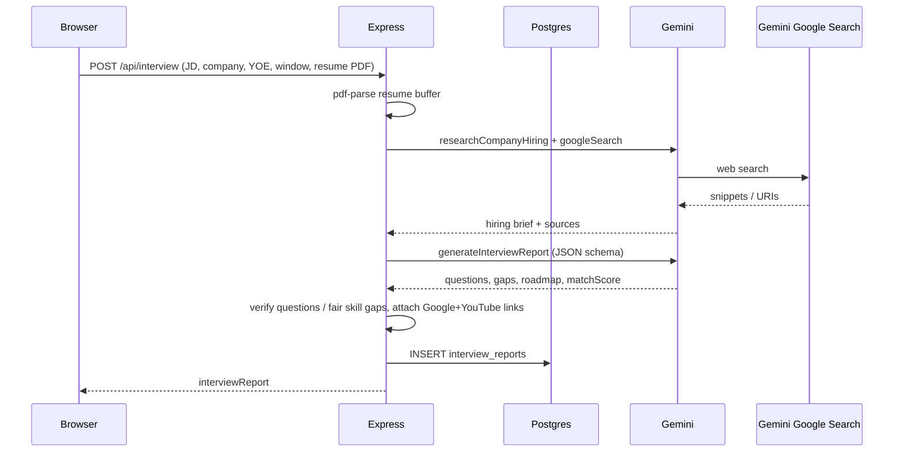
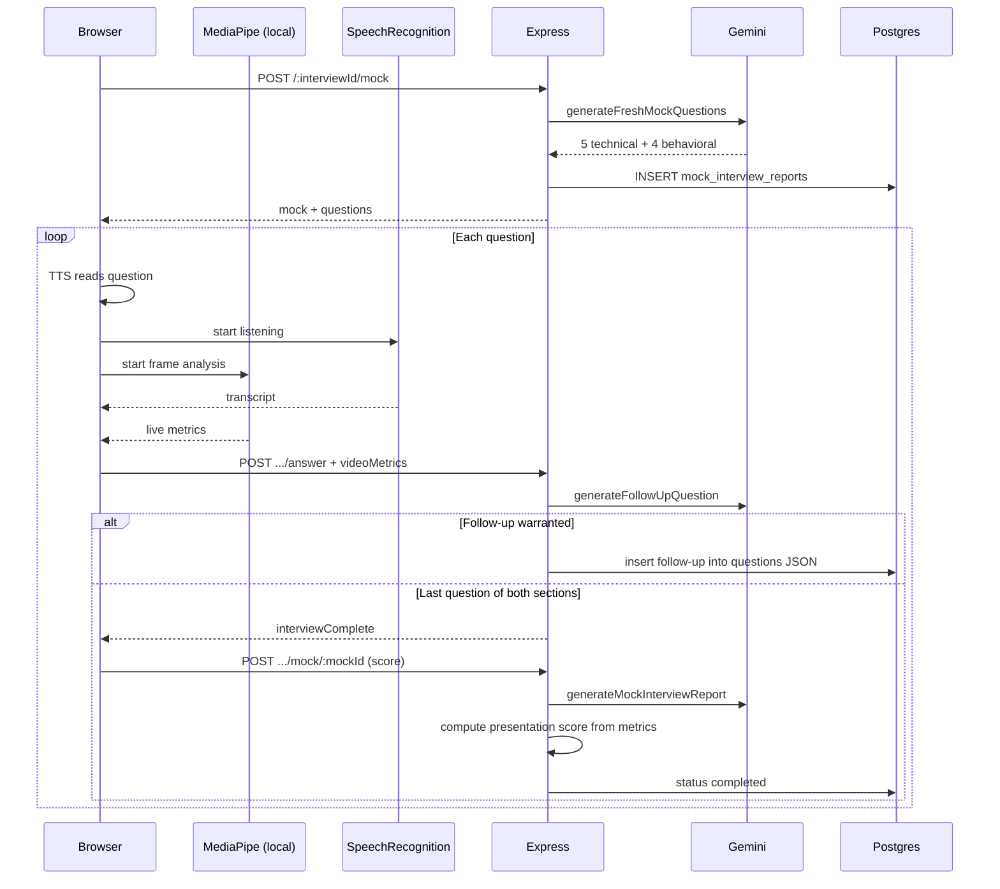

# Hirevia — Features, Implementation, and System Report

This document is the product map for Hirevia: what a user can do, how each feature is implemented, which external services are called, and how data moves through the stack.

**Stack at a glance**

| Layer | Technology |
| --- | --- |
| Frontend | React 19, Vite 8, React Router 7, Sass, Axios |
| Backend | Express 5 (CommonJS), Node |
| Database | PostgreSQL 16 (`pg`) |
| Cache | Redis 7 (`ioredis`) |
| AI | Google Gemini via `@google/genai` (`GOOGLE_GENAI_API_KEY`) |
| PDF in | `pdf-parse` (uploaded resume) |
| PDF out | Puppeteer (Chromium) |
| On-device CV | MediaPipe Face + Pose landmarkers (browser only) |
| Speech | Browser `SpeechRecognition` / `speechSynthesis` |

Default local ports: frontend `5173`, backend `3000`, Postgres `5433`, Redis `6379`.

---

## 1. Product overview

Hirevia is an interview-prep workspace. A candidate enters a **company**, **role**, **years of experience**, **interview window**, **job description**, and a **resume PDF and/or self-description**. The backend researches how that company hires, then Gemini writes a grounded prep plan. The candidate studies that plan, optionally downloads a JD-tailored one-page resume, and runs a **live mock** (camera + microphone). Answers can trigger a **follow-up**. When the mock ends, Gemini scores the transcript; presentation numbers come from local computer vision, not from the model inventing a camera score.

Video frames never leave the browser. Only numeric metrics travel with each answer.

---

## 2. User-facing features

### 2.1 Marketing landing (`/`)

Public page: hero, “how it works”, feature bento, guest nav. Logged-in users are sent to the workspace. No AI calls on this page.

**Files:** `Frontend/src/features/marketing/pages/Landing.jsx`

### 2.2 Authentication

| Action | Route | How it is done |
| --- | --- | --- |
| Register | `POST /api/auth/register` | Username + email + password. Password hashed with **bcryptjs** (cost 10). JWT signed with `JWT_SECRET` (1 day). Cookie `token` set (`httpOnly`). |
| Login | `POST /api/auth/login` | Email lookup in Postgres, bcrypt compare, same JWT cookie. |
| Session | `GET /api/auth/get-me` | Reads cookie, rejects Redis-blacklisted tokens, verifies JWT, returns public user or `null`. |
| Logout | `GET /api/auth/logout` | Token written to Redis `blacklist:{token}` (TTL 24h), cookie cleared. |
| Gate | `/app`, `/interview/*` | `Protected` waits for `get-me`, then redirects guests to `/login`. |

**No OAuth / Google login.** Auth is first-party only.

Protected API routes use `auth.middleware.js`: cookie JWT → Redis blacklist check → `req.user`.

**Files:** `Backend/src/controllers/auth.controller.js`, `Frontend/src/features/auth/`

### 2.3 Dashboard (`/app`)

Lists the user’s interview plans, match scores, and a simple progress chart from stored reports. Delete a plan here. Data from `GET /api/interview/`. No Gemini call.

**Files:** `Frontend/src/features/interview/pages/Dashboard.jsx`

### 2.4 New plan wizard (`/app/new`)

Three steps:

1. **Basic details** — company, job profile, years of experience (0–40), first-interview window.
2. **Job description** — pasted JD (required).
3. **Profile** — resume PDF (max 3 MB) and/or self-description. At least one required.

Interview windows map to roadmap length:

| Window id | Label | Roadmap days |
| --- | --- | --- |
| `dont_know` | Don't know | 24 |
| `within_3_days` | Within 3 days | 3 |
| `this_week` | This week | 7 |
| `next_week` | Next week | 10 |
| `in_2_weeks` | In 2 weeks | 14 |
| `in_3_weeks` | In 3 weeks | 21 |
| `in_1_month` | In about a month | 28 |
| `later` | Later than a month | 24 |

Submit sends `multipart/form-data` to `POST /api/interview/`. The UI cycles status copy (“Researching how this company interviews”, …) while the request runs.

**Files:** `Frontend/src/features/interview/pages/NewPlan.jsx`, `Backend/src/utils/interviewIntake.js`

### 2.5 Interview plan (`/interview/:interviewId`)

The main study surface. Tabs:

| Tab | What the user sees |
| --- | --- |
| **Technical** | Company-aware questions with “why they ask this” and a model answer. Question list + reader (Previous / Next). |
| **Behavioral** | Same reader for HR / STAR / co-curricular questions. |
| **Roadmap** | Day-by-day plan (exact day count from the interview window), tasks, Google/YouTube study links. |
| **Profile** | Stored JD, self-description, extracted resume text. |
| **Mocks** | Past live sessions; start or resume a mock. |

Also on this page:

- **Match score** (0–100) from Gemini, shown with tone coloring.
- **Focus areas** — verified skill gaps, short copy, compact severity chip, two study links (Google + YouTube).
- **ATS resume download** — template picker (Classic, Modern, Compact, Executive) + preview, then PDF download.

**Files:** `Frontend/src/features/interview/pages/Interview.jsx`

### 2.6 JD-tailored resume PDF

User picks a template → `POST /api/interview/resume/pdf/:interviewReportId`.

Pipeline:

1. Load stored resume text, self-description, and JD from Postgres.
2. **Gemini** rewrites the resume as HTML (facts must stay true; JD keywords only where they already apply). JSON schema enforces `{ html }`.
3. Server extracts original URLs / emails / LinkedIn / GitHub from the source text and **injects missing `<a href>` tags**.
4. Template CSS is injected (dense type, line-height ~1.1–1.12, single column, underlined links).
5. **Puppeteer** renders A4. If content is taller than ~1000px, the page is **scaled down** (minimum 0.35) so the PDF stays **one page**.

Templates are visual only. Content is the same facts.

**Files:** `Backend/src/services/ai.service.js` (`generateResumePdf`, `generatePdfFromHtml`, `extractResumeLinks`)

### 2.7 Live mock interview (`/interview/:id/mock` and `/:mockId`)

1. Choose **technical** or **behavioral** to start.
2. Backend generates a **fresh** question set (not a copy of the prep report) and creates a `mock_interview_reports` row.
3. Browser asks for **camera** (`getUserMedia`) and **microphone**.
4. Each question is spoken with **Web Speech Synthesis**.
5. “Start answering” starts:
   - Chrome/WebKit **SpeechRecognition** (cloud speech-to-text inside the browser API).
   - **MediaPipe** face + pose analysis on the webcam canvas (local WASM/models).
6. Candidate can edit the transcript in a textarea.
7. “Next” posts the answer + optional `videoMetrics` to `POST /api/interview/:id/mock/:mockId/answer`.
8. Gemini may insert **one follow-up** if the answer is thin.
9. After the last question in both sections, the UI scores the interview instead of hanging on a loading prompt.
10. **Pause** saves progress to `localStorage` + `PATCH .../progress` and returns to the plan.

Webcam video is **not uploaded**. Only aggregates (eye contact fraction, gaze-away rate, blink rate, posture, movement) are sent with the answer JSON.

**Files:** `MockInterview.jsx`, `useCamera.js`, `useSpeechRecognition.js`, `useVideoAnalyzer.js`, `videoAnalyzer.js`, `mockInterview.controller.js`

### 2.8 Mock report (`/interview/:id/mock/:mockId/report`)

After completion:

- Gemini scores each answer: **technical** and **communication** (0–10) from the transcript.
- **Presentation score** is computed in Node from the same CV metrics (Gemini is forbidden from inventing that number).
- Overall score, overall feedback, and per-answer feedback are stored and shown.

**Files:** `generateMockInterviewReport` in `ai.service.js`, `MockInterviewReport.jsx`

---

## 3. How AI and other external calls work

### 3.1 Gemini (the only LLM)

Client: `@google/genai` → `GoogleGenAI({ apiKey: process.env.GOOGLE_GENAI_API_KEY })`.

Wrapper: `generateContentWithRetry` in `Backend/src/services/ai.service.js`.

| Setting | Value |
| --- | --- |
| Preferred models | `gemini-2.5-flash-lite` → `gemini-2.5-flash` → `gemini-2.0-flash` |
| Retry | 2 attempts per model on 503 / 429 / UNAVAILABLE / RESOURCE_EXHAUSTED |
| Structured output | `responseMimeType: "application/json"` + JSON schema (Gemini or Zod→JSON Schema for resume) |

**Calls that hit Gemini**

| Function | When | Tools / extras | Output |
| --- | --- | --- | --- |
| `researchCompanyHiring` | New plan | **`googleSearch` grounding** (Flash, not lite) | Hiring brief + source URIs |
| `generateInterviewReport` | New plan (after research) | JSON schema | Match score, questions, gaps, roadmap, validation |
| `generateResumePdf` | Resume download | JSON schema `{ html }` | ATS HTML |
| `generateFreshMockQuestions` | Start mock | JSON schema | 5 technical + 4 behavioral |
| `generateFollowUpQuestion` | Each submitted answer (if not already a follow-up) | JSON schema | `shouldFollowUp` + optional question |
| `generateMockInterviewReport` | Mock complete | JSON schema | Per-answer scores + overall feedback |

Company research uses a **different model list** (`gemini-2.5-flash`, `gemini-2.0-flash`) because Search grounding is more reliable there. If Search fails, generation continues with a fallback brief (“infer from company + JD”).

There is **no OpenAI usage** in source (the `openai` npm package is unused). There is no LangChain.

### 3.2 Google Search (via Gemini, not a separate key)

`tools: [{ googleSearch: {} }]` on the research call. Gemini performs web search and returns `groundingMetadata.groundingChunks` (up to 8 source URIs stored on the report as `company_research.sources`).

This is **not** the Custom Search JSON API. It is Gemini’s built-in Search tool, billed/authorized through `GOOGLE_GENAI_API_KEY`.

### 3.3 Google / YouTube links (not API calls)

Skill-gap and roadmap resources are **constructed search URLs**:

- `https://www.google.com/search?q=...`
- `https://www.youtube.com/results?search_query=...`

Added in `interviewIntake.js` (`withSkillGapResources`, `withDayResources`) so every gap/day has links even if Gemini omitted them. Opening a link is a normal browser navigation, not a backend API.

### 3.4 Puppeteer / Chromium

Used only for resume PDF. Headless Chrome, optional `PUPPETEER_EXECUTABLE_PATH` in Docker. No network fetch of the resume HTML (styles are inlined).

### 3.5 pdf-parse

Uploaded resume PDF → text in memory (`multer` memory storage, 3 MB cap). Text is stored on `interview_reports.resume` and fed to Gemini. The original PDF file is not kept.

### 3.6 MediaPipe (browser, CDN)

On mock start, the analyzer loads:

- WASM: `cdn.jsdelivr.net/npm/@mediapipe/tasks-vision@1.0.1/wasm`
- Face model: `storage.googleapis.com/mediapipe-models/face_landmarker/...`
- Pose model: `storage.googleapis.com/mediapipe-models/pose_landmarker_lite/...`

These download to the **user’s browser**. Inference is local. Sample interval ~80 ms.

### 3.7 Browser speech APIs

| API | Direction | Notes |
| --- | --- | --- |
| `webkitSpeechRecognition` / `SpeechRecognition` | Speech → text | Chrome’s implementation is typically cloud-backed by Google; that is a **browser** call, not Hirevia’s backend. |
| `speechSynthesis` | Text → speech | Local voices. Used to read each mock question. |

### 3.8 What is not called

- No Stripe / payments
- No email provider
- No S3 / object storage
- No OpenAI, Anthropic, or Puter runtime in application code
- Video is never posted to the API

---

## 4. End-to-end flows

### 4.1 Create a prep plan

Server-side verification after Gemini (`generateInterviewReport` post-process):

- Drop technical questions that invent known technologies present in **neither** resume, JD, nor research.
- Keep behavioral questions as-is (soft-skill track).
- Skill gaps: keep only if the skill appears in the JD or research **and** not in the resume/self-description.
- Also add **programmatic** gaps from a known-tech lexicon (e.g. Prisma, TypeScript) when the JD lists them and the resume does not.
- Attach study links; normalize roadmap days.

### 4.2 Live mock + follow-up

### 4.3 Resume download

Browser → auth → load report → Gemini HTML → inject original links → Puppeteer scale-to-one-page → `application/pdf` download.

---

## 5. HTTP API catalog

All interview/mock routes require the JWT cookie unless noted.

### Auth — `/api/auth`

| Method | Path | Auth |
| --- | --- | --- |
| POST | `/register` | Public |
| POST | `/login` | Public |
| GET | `/logout` | Public (uses cookie if present) |
| GET | `/get-me` | Public (returns `user: null` if none) |

### Interview — `/api/interview`

| Method | Path | Purpose |
| --- | --- | --- |
| GET | `/api/health` | Liveness; reports `postgres` + `redis` |
| POST | `/` | Create plan (multipart: resume + fields) |
| GET | `/` | List current user’s plans |
| GET | `/report/:interviewId` | One plan |
| DELETE | `/report/:interviewId` | Delete plan (cascades mocks) |
| POST | `/resume/pdf/:interviewReportId` | Download tailored PDF |
| GET | `/:interviewId/mock` | List mocks for a plan |
| POST | `/:interviewId/mock` | Start mock (fresh questions) |
| POST | `/:interviewId/mock/:mockId/answer` | Submit answer, maybe follow-up |
| PATCH | `/:interviewId/mock/:mockId/progress` | Pause / persist cursor |
| POST | `/:interviewId/mock/:mockId` | Generate scored report |
| GET | `/:interviewId/mock/:mockId/report` | Fetch mock (in progress or scored) |
| DELETE | `/:interviewId/mock/:mockId` | Delete mock |

Frontend Axios uses `VITE_API_URL` and `withCredentials: true`.

---

## 6. Data model (Postgres)

### `users`

`id`, `username`, `email`, `password` (hash), timestamps.

### `interview_reports`

Owned by `user_id`. Stores intake (`company`, `job_profile`, `years_of_experience`, `interview_window`), extracted `resume` text, `job_description`, `self_description`, `company_research` (JSONB brief + sources), `match_score`, and JSONB arrays: `technical_questions`, `behavioral_questions`, `skill_gaps`, `preparation_plan`, plus `validation`.

### `mock_interview_reports`

Owned by user + parent interview. JSONB `questions` `{ technical, behavioral }`, `answers`, cursor (`current_section`, `current_question_index`), `completed_sections`, scores, `presentation_summary`, `status` (`in-progress` | `completed`).

Deletes cascade: user → plans → mocks.

Redis (TTL 24h):

- `blacklist:{jwt}` — logged-out tokens
- `interview:{id}` / `mock:{id}` — document cache used by repositories

`localStorage` key `mock_{mockId}` holds pause/resume UI state (section, index, answers, draft).

---

## 7. Frontend map

| Path | Page | Protected |
| --- | --- | --- |
| `/` | Landing | No |
| `/login`, `/register` | Auth forms | No |
| `/app` | Dashboard | Yes |
| `/app/new` | New plan wizard | Yes |
| `/interview/:interviewId` | Plan | Yes |
| `/interview/:interviewId/mock` | Choose section / start | Yes |
| `/interview/:interviewId/mock/:mockId` | Live session | Yes |
| `/interview/:interviewId/mock/:mockId/report` | Scores | Yes |

Shared UI: `AppShell` (nav + sign out), `LoadingScreen`, `ProgressChart`, `FormattedAnswer`, `ResumePreview`.

---

## 8. Detailed system report

### 8.1 Architecture

Hirevia is a **two-process web app** plus two data services.

- The **SPA** never talks to Gemini directly. All model calls go through Express so the API key stays on the server.
- **Postgres** is the source of truth. **Redis** speeds repeat reads and implements JWT logout.
- **Docker Compose** can run only Postgres + Redis (typical local dev) or the full stack (`--profile full`). Schema is applied on backend startup (`migrate.js` + `schema.sql`).

This is a **synchronous request/response** design. A new plan waits on: Search research + structured report generation. A mock start waits on a fresh question set. Answer submit waits on follow-up classification. Completing a mock waits on evaluation. There is no job queue (no Bull/BullMQ). Long Gemini latency surfaces as loading screens; 503/429 are retried, then returned as “AI service is temporarily busy.”

### 8.2 Grounding and fairness

The product’s main quality rule is: **do not invent the candidate’s background, and do not invent employer-specific rounds without evidence.**

1. Company Search brief is treated as authoritative for *question types* (DSA vs HLD vs case vs skip system design).
2. Technical questions may cite resume, JD, **or** research.
3. A post-filter removes questions that mention a known technology that appears in none of those sources.
4. Skill gaps must be “fair”: in JD or research, missing from resume/self-description. A second programmatic pass catches JD techs the model missed.
5. Mock questions are generated **against** the existing prep list so the live interview is not a recitation of the study sheet.

### 8.3 Scoring philosophy (mocks)

| Signal | Source | Who scores it |
| --- | --- | --- |
| Content accuracy | Transcript | Gemini `technicalScore` |
| Clarity / structure | Transcript | Gemini `communicationScore` |
| Eye contact, gaze, posture, movement | MediaPipe in the browser | Deterministic formula in Node (`computePresentationScore`) |

Gemini is instructed not to invent presentation numbers or psychological claims (“nervous”, “dishonest”). Qualitative wording should stay observational.

### 8.4 Privacy and data handling

| Data | Stored | Leaves the machine |
| --- | --- | --- |
| Password | bcrypt hash in Postgres | No plaintext |
| JWT | HttpOnly cookie | Sent to Hirevia API only |
| Resume PDF | Discarded after parse | Text sent to Gemini |
| JD, self-description, company | Postgres + Gemini prompts | Yes, to Google Gemini |
| Company research sources | JSONB | Produced by Gemini Search |
| Webcam frames | Never stored | No |
| Video metrics | With answers in Postgres | Yes (numbers only) |
| Speech audio | Not stored by Hirevia | Chrome may send audio to Google’s speech service |

### 8.5 Reliability

- Gemini wrapper: model fallback + backoff on transient errors.
- Company research failure is **non-fatal**; plan generation still runs.
- Follow-up generation failure is **non-fatal**; the next planned question is used.
- Fresh mock generation failure falls back to questions copied from the prep report (`fallbackQuestionsFromReport`).
- Pause writes both Redis/Postgres progress and `localStorage` so a closed tab can resume.
- After the last mock question, the client finishes if `interviewComplete` **or** the next payload has no question text (avoids a stuck “loading next question” state).

### 8.6 Security notes (current)

- Auth is cookie JWT + Redis denylist. CORS is origin-allowlisted (`CLIENT_ORIGINS` or localhost + one Render host).
- File upload is memory-only, 3 MB, single field `resume`.
- Resource URLs are checked for `http:` / `https:` before being stored/shown.
- Resume HTML from Gemini is not a user-facing page in the app (it is printed via Puppeteer), which limits XSS to the PDF pipeline.
- There is no role model (every user only sees their own rows via `user_id` filters).
- `openai` is in `Backend/package.json` but unused. `@heyputer/puter.js` is in the frontend package but unused.

### 8.7 Feature completeness vs. typical interview products

**Implemented**

- Company-aware plans with live web research
- Experience-band and interview-window-sized roadmaps
- Grounded technical + behavioral banks + model answers
- Fair skill-gap detection + study links
- Four ATS resume skins, one-page PDF, link preservation
- Fresh live mocks, adaptive follow-ups, pause/resume
- Local presentation analytics + transcript scoring
- Dashboard of plans and mock history

**Not implemented**

- Multi-user orgs, sharing, or recruiter accounts
- Payments / plans / usage caps
- Email verification or password reset
- Mobile native apps (responsive web only)
- Server-side recording or playback of the mock video
- Human interviewer or calendar booking
- Fine-tuned custom model (all generation is prompted Gemini)

### 8.8 Operational dependencies

Required to run a full product loop:

1. Postgres and Redis up
2. `JWT_SECRET`
3. `GOOGLE_GENAI_API_KEY` with access to Gemini + Search grounding
4. Chromium available to Puppeteer (local cache or `PUPPETEER_EXECUTABLE_PATH`)
5. A Chromium-based browser for SpeechRecognition during mocks (Firefox support is limited)

Without Gemini, auth and stored reports still load; **creating** a plan, **starting** a mock, **follow-ups**, **scoring**, and **resume PDFs** fail.

### 8.9 Code map (where to look)

| Concern | Primary files |
| --- | --- |
| All Gemini prompts | `Backend/src/services/ai.service.js` |
| Plan HTTP | `Backend/src/controllers/interview.controller.js` |
| Mock HTTP | `Backend/src/controllers/mockInterview.controller.js` |
| Intake + resource URLs | `Backend/src/utils/interviewIntake.js` |
| Schema | `Backend/src/db/schema.sql` |
| Redis | `Backend/src/services/cache.service.js` |
| Plan UI | `Frontend/src/features/interview/pages/Interview.jsx` |
| Mock UI | `Frontend/src/features/interview/pages/MockInterview.jsx` |
| Local CV | `Frontend/src/features/interview/services/videoAnalyzer.js` |
| Routes | `Frontend/src/app.routes.jsx`, `Backend/src/app.js` |

---

## 9. Quick “what happens when I click X”

| User action | External / heavy work |
| --- | --- |
| Create account / login | Postgres + bcrypt + JWT (no AI) |
| Generate plan | pdf-parse + Gemini Search + Gemini JSON report |
| Open a saved plan | Postgres (Redis cache if warm) |
| Download resume | Gemini HTML + Puppeteer PDF |
| Start mock | Gemini fresh questions |
| Speak an answer | Browser speech API; MediaPipe locally |
| Next question | Gemini follow-up decision |
| Finish mock | Gemini evaluation + local presentation formula |
| Sign out | Redis blacklist |

That is the full feature surface and the implementation path behind each piece.
